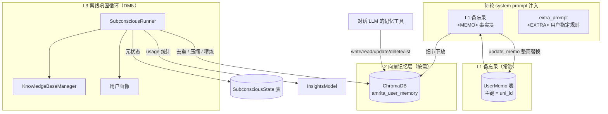
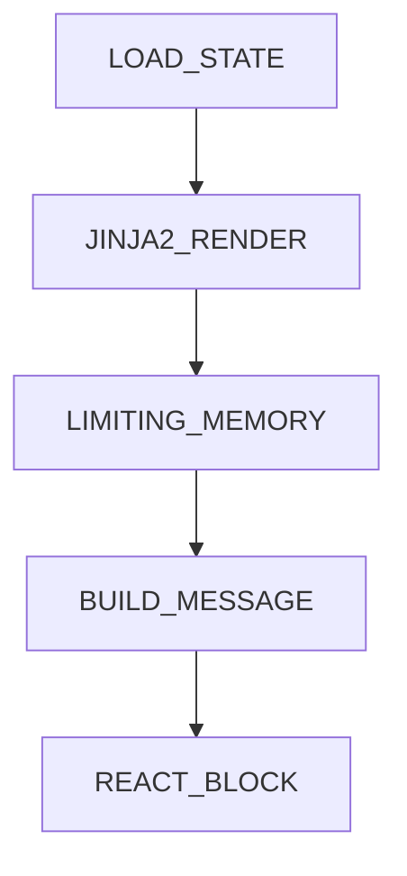
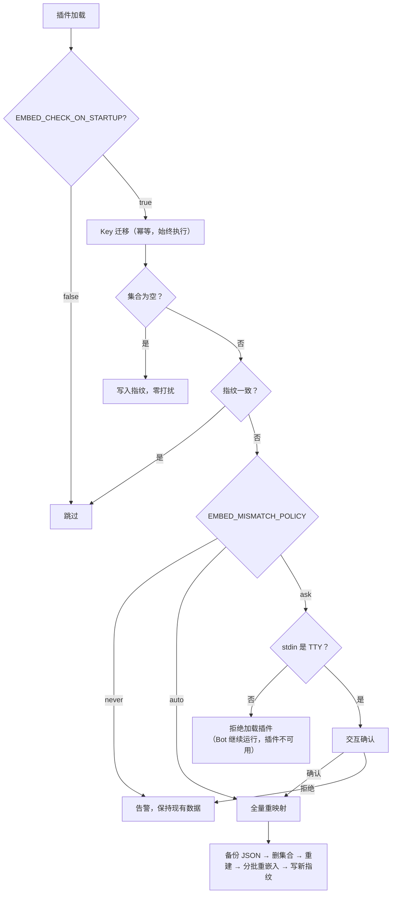
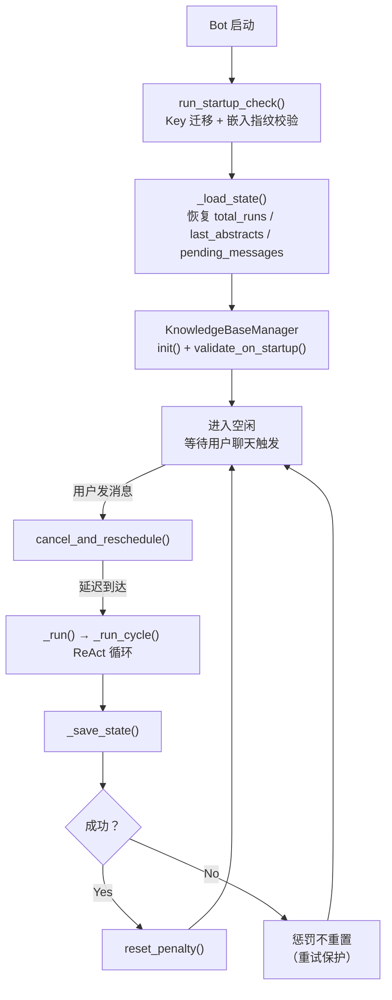

# amrita_plugin_memory

基于向量数据库的长期记忆插件 — **三层记忆模型**：

| 层 | 名称          | 类比                       | 载体                             | 何时使用             |
| -- | ------------- | -------------------------- | -------------------------------- | -------------------- |
| L1 | 备忘录        | 恒常激活的持久记忆         | 插件自有 ORM 表（per-uni_id 单行） | 每轮常驻注入         |
| L2 | 向量记忆层    | 语义记忆（按线索提取）     | ChromaDB 向量库                   | LLM 按需检索         |
| L3 | 离线巩固循环  | 默认模式网络（DMN）        | 后台 ReAct Agent                  | 静默期自动整理       |

- **L1** — 一段千字内的用户元信息（身份、稳定偏好、用户要求的工具调用模式），由 LLM 维护，每轮注入 system prompt。
- **L2** — 向量化的长尾事实库，LLM 通过工具按需读写，ChromaDB 语义检索。
- **L3** — 用户静默时触发的后台整理循环：去重、压缩、画像精炼、知识沉淀。

## 安装

```bash
ambot plugin add amrita_plugin_memory
```

前置依赖：Python 3.11+ / AmritaBot 实例 / **Ollama 或 OpenAI 嵌入服务** / ChromaDB。

> 嵌入服务是**必需**前置 —— 本插件不自带嵌入模型。

## 快速开始

### 1. 配置环境变量（`.env`）

```env
VECTOR_DB_TYPE=local
EMBEDDING_MODEL_URL=http://127.0.0.1:11434
EMBEDDING_MODEL_NAME=auto
EMBEDDING_PROCTOL=ollama-embed
```

### 2. L1 + L2 开箱可用

无需额外配置。LLM 会在需要时自动调用 `write_memory` / `read_memory` / `update_memo` 等工具；
L1 备忘录一旦写入，此后每轮对话都会自动注入。

### 3. 开启 L3 离线巩固循环（可选）

编辑 `config/amrita_plugin_memory/config.toml`：

```toml
[subconscious]
enabled = true
target_user_id = "你的QQ号"
```

用户每次发消息后，后台 Agent 会在 30 分钟后自动整理记忆库。

> **适用场景**：L3 专为**个人助理**场景设计 —— 单个 Bot 服务单个用户。
> 它会在后台持续调用 LLM，**每轮推理可能消耗数万 tokens**。
> 如果 Bot 服务于大量用户或对 token 成本敏感，建议保持 `enabled = false`。

允许 Agent 主动发私聊消息：

```toml
allow_send_to_user = true
```

关闭全局知识库以节省 token：

```toml
enable_knowledge = false
```

> 知识库当前依赖 L3 —— 当 `enabled = false` 时，知识库也会自动禁用。

### 4. 验证

```bash
ambot memory status      # 查看嵌入指纹、记忆分布与备份
```

观察日志中 `[Subconscious]` / `[Memory]` 前缀的输出：

```text
[Subconscious] Starting for user=你的QQ号
[Subconscious] Idle — waiting for user chat to trigger first run
```

用户发消息后约 30 分钟，会看到 `Cycle #1` 开始执行。

---

## 三层记忆模型



### L1 与 `extra_prompt` 的正交性

两者都会注入 system prompt，但来源、作者与优先级完全不同：

|          | `extra_prompt`                     | L1 备忘录                          |
| -------- | ---------------------------------- | ---------------------------------- |
| 作者     | **用户**逐字指定（`/prompt` 命令） | **LLM** 规范化提取                 |
| 管理方式 | 用户自己增删改                     | LLM 自主维护                       |
| 注入形态 | `<EXTRA>` 规则块，**冲突时忽略**   | `<MEMO>` 事实块，作为可信背景      |
| 语义     | 用户想要的行为指令                 | LLM 学到的关于该主体的元信息       |

插件**不会**读写 `extra_prompt` —— 那是用户的领地。

### 命名对照表

L3 在代码中沿用历史标识符 `subconscious` / `rethinking`（避免破坏性变更），
文档统一表述为"离线巩固循环"，其行为与神经科学的**默认模式网络（DMN）**高度对应：

| 代码标识符                        | 文档表述       | DMN 对应特征                                     |
| --------------------------------- | -------------- | ------------------------------------------------ |
| `rethinking/` 模块                | 离线巩固循环   | —                                                |
| `SubconsciousRunner`              | 巩固循环运行器 | —                                                |
| `[subconscious]` 配置节           | 巩固循环配置   | —                                                |
| `subconscious_*` 工具             | 巩固循环工具   | —                                                |
| 用户聊天 → `cancel_and_reschedule` | 任务负激活     | 专注任务时 DMN 被抑制                            |
| 静默期触发 `_run`                 | 空闲时活跃     | DMN 在无任务时活跃                               |
| 去重 / 压缩 / `MemoryLimiter`      | 记忆巩固       | 海马 → 皮层的系统巩固                            |
| 画像构建（`*_profile`）            | 自传体记忆     | DMN 负责自我参照加工                             |
| 主动消息（`send_to_user`）         | 心智游移       | 走神产生与自我相关的念头                         |
| 每轮数万 tokens                    | 静息高能耗     | DMN 占脑能耗约 20%                               |

> 它**不是**弗洛伊德式的"潜意识"：触发确定性、工具显式、日志完整、输入输出全透明。
> 它也不是"常驻循环"——而是**事件驱动的单次任务**，跑完即空闲；用户聊天越频繁，它跑得越少。

---

## L1 备忘录

**定位**：每次对话都要用到的恒常信息 —— 身份（名字 / 证件 / 电话）、稳定偏好、
**用户要求的工具调用模式**。类比人类恒常激活的持久记忆。

### 关键约束：严格字数上限

`memo_max_chars`（默认 **1000** 字）是**硬上限**。这带来一个根本约束：
写入原语必须是**整篇替换**而非追加，否则上限形同虚设。

因此 `update_memo` 的语义是：

```text
LLM 读当前 memo → 融合新事实 → 输出新全文 → 服务端校验长度 → 落库
```

超长时工具**拒绝写入**并返回当前字数，由 LLM 自行压缩后重试。

### 内容规范

| 该放 L1                     | 该放 L2                         |
| --------------------------- | ------------------------------- |
| 身份信息、稳定偏好          | 具体事件、长尾偏好              |
| 用户要求的工具调用模式      | 项目细节、讨论记录              |
| 当前活跃上下文（高度浓缩）  | 任何不需要每轮都看到的内容      |

写入指南（写进 L3 的提示词）：

- 只写**陈述性事实**，不写祈使句规则（规则属于 `extra_prompt`）
- 内部按 `身份 > 偏好 > 工具模式 > 近期上下文` 排序，压缩时从尾部开始丢
- 临近上限时，细节应**下放 L2**，memo 只留指针（如"用户有 3 个项目"）

### 存储与注入

- **表**：`amrita_plugin_memory_user_memo`，主键 `user_id` = 框架 uni_id
- **群与个人是同一张表的不同行**：
  - `QQPlatform_Private_{qq}` / `user_{qq}` → 个人备忘录
  - `QQPlatform_Group_{群号}` / `group_{群号}` → 群备忘录
- **注入**：`on_precompletion` hook（priority=15），与 L3 **完全解耦**（L3 关闭时 L1 照常工作）
  - 私聊 → 注入个人 memo
  - **群聊 → 只注入群 memo**（发言人的个人 memo 不注入，避免隐私外泄）
  - 空 memo 不注入，行为自然降级
- **缓存**：进程内 `LRUCache(128)`，写入时穿透失效

### 工具

| 工具          | 参数      | 说明                                         |
| ------------- | --------- | -------------------------------------------- |
| `update_memo` | `content` | 整篇替换当前作用域的备忘录，超长则拒绝       |

---

## L2 向量记忆层

**定位**：长尾事实库 —— 只在需要时检索，不常驻。类比需要线索提取的语义记忆。

### 分区键（uni_id）

分区键**跟随已安装 Amrita 的会话 ID 格式**（`amrita.plugins.chat.utils.sql.make_uni_id`）：

| Amrita 版本 | 格式                                               |
| ----------- | -------------------------------------------------- |
| ≤ 1.9.x     | `user_{qq}` / `group_{群号}`                       |
| 开发中      | `QQPlatform_Private_{qq}` / `QQPlatform_Group_{群号}` |

插件不硬编码任一格式，而是委托框架生成 —— Amrita 升级后自动跟随。
存量数据的 Key 迁移由启动检查自动完成（见下节）。

`scope` 参数表达语义，与 uni_id 类型是两个维度：

| `scope` | 含义                       | 可用场景   |
| ------- | -------------------------- | ---------- |
| `user`  | 个人专属（群聊私聊互通）   | 任意       |
| `group` | 群共享（群内所有人可见）   | 仅群聊     |

### 记忆元数据

每条记忆带 `user_id` / `scope` / `tags` / `importance` / `created_at`。
`importance` 分 `low` / `medium` / `high`，可在检索时作为过滤条件。

### 检索

`read_memory` 用嵌入向量做相似度搜索，支持 `top_k` 与 `importance` 过滤。
删除群共享记忆需管理员或群主权限。

检索结果附带**距离**（`distances`）——ChromaDB 默认使用 `l2`（平方欧氏距离）空间，
因此**数值越小越相似**（完全相同的向量为 `0`）。`/memory user search` 输出中的
"距离"即此值。

> 距离是原始度量而非归一化相似度：`l2` 空间下其取值范围取决于向量是否归一化，
> 因此不要跨模型比较绝对值，只用于同一查询内的相对排序。

---

## L3 离线巩固循环（DMN）

### 触发：事件驱动 + 指数惩罚退避

**不使用定时自循环** —— 只有目标用户发消息时才触发。

用户每次聊天 → 取消现有计划 → 惩罚计数 +1 → 重新计算延迟：

$$\text{delay} = \min(\text{base} \times \text{multiplier}^{\text{penalty}-1},\ \text{cap})$$

默认 `base=30min`、`multiplier=1.5`、`cap=1440min`。推理成功后惩罚重置为 0。
用户连续聊天会自动推开推理（**任务负激活**），长时间沉默后恢复正常频率。

### 每轮做什么

| 阶段           | 内容                                                       |
| -------------- | ---------------------------------------------------------- |
| 状态加载       | 从 `SubconsciousState` 表恢复 `total_runs` / 摘要窗口      |
| 记忆限幅       | Core `MemoryLimiter` 截断超限消息并生成摘要                |
| ReAct 循环     | Agent 调用 `subconscious_*` 工具执行整理                   |
| 后处理         | 更新全局 usage、持久化元状态、重置惩罚、调度下次运行       |

### 整理职责

- **去重合并**：`subconscious_duplicate_helper` 返回待整理记忆 + 合并指导
- **重要性校准**：评估每条记忆的 `low` / `medium` / `high`
- **标签管理**：确保 tags 有意义且一致
- **画像精炼**：`*_profile` 渐进式构建用户画像（行级增量更新）
- **知识沉淀**：把可迁移的经验写入全局知识库
- **备忘录压缩**（L1 联动）：临近上限时把细节下放 L2

### Workflow 管线



`SubconsciousRunner` 把 ChatObject 当数据容器，注入自定义 `SubconsciousBackend`
（隔离的工具 + memory 后端）与 Core `ReActAgentStrategy`。
`LIMITING_MEMORY` 在 Agent Loop 前运行 Core `MemoryLimiter`。

---

## 嵌入模型与重映射

### 为什么需要指纹

向量只有在**同一嵌入模型**下才可比。更换模型（`nomic-embed-text` → `bge-m3`）
甚至只是服务端同名模型被更新，旧向量都会退化为噪声 —— 但 ChromaDB 不会报错，
检索结果会静默劣化。

因此插件在集合 metadata 中记录**嵌入配置指纹**：

```
fingerprint = sha256(protocol | model | base_url)
```

随库走（远程 Chroma 同样生效），并在**每次启动**校验。

### 启动检查流程

检查在**插件 import 期**（同步）执行：



**重映射对维度变化天然免疫** —— 走"删集合 → 重建"路径，因此无需探测向量维度。

**失败中断**：保留半成品集合 + 备份 + **不写新指纹**，下次启动重新提示（幂等重试）。

### 配置

| 环境变量                 | 默认值 | 说明                                                       |
| ------------------------ | ------ | ---------------------------------------------------------- |
| `EMBED_CHECK_ON_STARTUP` | `true` | 设为 `false` 跳过检查（排查 / 迁移期间临时使用）           |
| `EMBED_MISMATCH_POLICY`  | `ask`  | `ask`=交互确认；`auto`=自动重映射；`never`=仅告警继续      |
| `REEMBED_BATCH_SIZE`     | `64`   | 重映射时每批嵌入的文本条数                                 |
| `REEMBED_BACKUP_KEEP`    | `3`    | 保留的历史备份份数                                         |

> `ask` 策略下，**非交互环境**（systemd / Docker）会拒绝加载插件并给出明确指引。
> 这类部署建议显式设置 `EMBED_MISMATCH_POLICY`。

### 已知限制

**模型名不变但服务端实际模型被换**（如 ollama 同名 tag 更新）无法检测 ——
指纹只看配置。此时用 `ambot memory reindex` 手动强制重映射。

### 备份

重映射前自动把集合全量内容落盘到 `data/amrita_plugin_memory/backups/embed_backup_<时间戳>.json`
（ids + documents + metadatas）。这是"删集合重建"路径**唯一的回滚手段**。

> 备份不含向量 —— 恢复时用**当前**模型重新嵌入，这正是恢复场景需要的。

---

## 工具参考

### 表层工具（对话 LLM 可用）

| 工具                | 参数                                          |
| ------------------- | --------------------------------------------- |
| `write_memory`      | content, tags, importance(enum), scope(enum)  |
| `read_memory`       | query, top_k(5), importance?, scope(enum)     |
| `update_memory`     | id, scope, content?, tags?, importance?       |
| `delete_memory`     | id, scope                                     |
| `list_memory`       | limit, scope                                  |
| `update_memo`       | content（L1 备忘录整篇替换）                  |
| `knowledge_list`    | —                                             |
| `knowledge_read`    | kid, start_line?, end_line?                   |
| `knowledge_search`  | query, top_k?                                 |
| `knowledge_suggest` | action, title, summary, body, reason          |

### 巩固循环工具（`rethinking/tools.py`，共 20 个）

记忆与 session/画像工具注册在隔离的 `_SUBCONSCIOUS_TOOLS` 上，不污染全局工具管理器。
知识库的 `list`/`read`/`search` 双重注册（表层 + 循环均可调用）；
`create`/`update`/`delete` 仅循环可用，表层通过 `knowledge_suggest` 提交建议。

| 工具                             | 用途                                   |
| -------------------------------- | -------------------------------------- |
| `subconscious_read_memory`       | 语义检索                               |
| `subconscious_write_memory`      | 写入新记忆                             |
| `subconscious_update_memory`     | 更新指定 ID 记忆                       |
| `subconscious_delete_memory`     | 删除指定 ID 记忆                       |
| `subconscious_list_memory`       | 列出全部记忆                           |
| `subconscious_iter_stop`         | 结束本轮推理                           |
| `subconscious_send_to_user`      | 主动向用户发消息                       |
| `subconscious_read_chat_context` | 读取最近聊天记录                       |
| `subconscious_duplicate_helper`  | 去重辅助（返回记忆 + 合并指导 prompt） |
| `subconscious_get_memory_stats`  | 统计概览                               |
| `subconscious_knowledge_list`    | 列出全局知识条目                       |
| `subconscious_knowledge_read`    | 读取知识条目（支持行滑动）             |
| `subconscious_knowledge_create`  | 创建知识条目                           |
| `subconscious_knowledge_update`  | 更新知识条目                           |
| `subconscious_knowledge_delete`  | 删除知识条目                           |
| `subconscious_knowledge_search`  | 语义搜索知识库                         |
| `subconscious_read_suggestions`  | 读取待审查的知识建议（读取后清空）     |
| `subconscious_read_sessions`     | 读取归档 sessions（LLM 摘要）          |
| `subconscious_get_profile`       | 读取用户画像（行滑动窗口）             |
| `subconscious_update_profile`    | 增量更新用户画像                       |

---

## 命令参考

### 用户命令 `/memory`

```text
/memory user list             — 列出个人记忆
/memory user search <关键词>  — 搜索个人记忆
/memory user delete <ID>      — 删除个人记忆
/memory group list            — 列出群共享记忆
/memory group search <关键词> — 搜索群共享记忆
/memory group delete <ID>     — 删除群共享记忆（仅管理员 / 群主）
```

兼容旧格式 `/memory list` 等（默认以个人范围执行）。

### 运维命令 `ambot memory`

需要本地安装含该命令组的 ambot-inlinectl（见 [开发](#开发)）。

| 命令                           | 作用                                             |
| ------------------------------ | ------------------------------------------------ |
| `ambot memory status`          | 显示指纹、记忆分布、分区键版本、备份列表         |
| `ambot memory reindex [--yes]` | 强制全量重映射并写新指纹                         |
| `ambot memory migrate-keys [--dry-run]` | 迁移分区键到当前 Amrita 的 uni_id 格式   |
| `ambot memory reset-fingerprint` | 只写指纹、不重嵌入（逃生舱）                   |
| `ambot memory backup list`     | 列出备份                                         |
| `ambot memory backup create`   | 手动创建备份                                     |
| `ambot memory backup restore <file>` | 从备份恢复（用当前模型重新嵌入）           |

> 这些命令会先设置 `EMBED_CHECK_ON_STARTUP=false` 再加载插件 ——
> 避免启动检查在 CLI 中触发交互，保证命令**永远可用**（逃生舱）。

---

## 持久化与状态恢复

### 存储

| 存储             | 技术                                                         | 存什么                                                                                             |
| ---------------- | ------------------------------------------------------------ | -------------------------------------------------------------------------------------------------- |
| L1 备忘录        | `UserMemo` 表（插件自有 ORM，主键 = uni_id）                 | LLM 维护的常驻用户元信息（≤ `memo_max_chars`）                                                     |
| 循环元状态       | `SubconsciousState` 表（插件自有 ORM，uid=`amrita_memory`）  | `total_runs`、`last_abstracts`、`pending_messages`、`knowledge_suggestions`                        |
| Session 摘要缓存 | `LRUCache[int, str]`（最大 128 条）                          | session DB id → LLM 生成的摘要文本，避免重复调用 MemoryLimiter                                     |
| 惩罚计数器       | 内存（不持久化）                                             | `_penalty_count`：重启后从 0 开始                                                                  |
| L2 记忆          | ChromaDB `amrita_user_memory`                                | 向量 + documents + metadatas（含嵌入指纹与分区键版本）                                             |
| 用户画像         | `data/amrita_plugin_memory/user_profile.md`                  | Markdown 文件，`summary---body` 格式，行级增量更新                                                 |
| 全局知识库       | `data/amrita_plugin_memory/knowledge/` + `knowledge_index.json` + ChromaDB | 三方同步管理                                                                        |
| Token 统计       | `InsightsModel`（复用 Bot ORM）                              | 全局 prompt/completion token 累加                                                                  |

### ORM 与迁移

插件使用 `nonebot_plugin_orm`，自带迁移链：

| revision         | 内容                          |
| ---------------- | ----------------------------- |
| `21f55abc2b90`   | `UserMemo` 表（分支根，`depends_on=072361e8936f`） |
| `6004d221a7de`   | `SubconsciousState` 表        |

迁移随包分发（`amrita_plugin_memory/migrations/`），并**依赖 Bot 的迁移链**
（`depends_on` 指向 `nonebot_plugin_amrita` 的初始迁移），保证外键引用有效。

### 生命周期



**跨重启连续性**：`last_abstracts` 通过 Jinja2 模板 `{{ last_abstracts }}` / `{{ last_run }}`
注入 prompt，让 Agent 知道"上一轮做了什么"。

**惩罚计数器不持久化**：重启本身即一次完整"冷启动"，记忆整理结果已通过 ChromaDB 持久化，
无需保留旧退避状态。

---

## 技术栈

| 组件       | 技术                                               |
| ---------- | -------------------------------------------------- |
| 后端框架   | Python 3.10+ / NoneBot2 / AmritaCore / AmritaSense |
| 向量数据库 | ChromaDB（PersistentClient / HttpClient）          |
| 嵌入模型   | OpenAI Embedding / Ollama Embedding                |
| 调度引擎   | nonebot_plugin_apscheduler（date trigger）         |
| 持久化     | nonebot_plugin_orm（插件自有模型 + 迁移链）        |
| Token 统计 | InsightsModel（复用 Bot 全局 usage）               |
| 缓存       | nonebot_plugin_amrita.cache.LRUCache               |
| 配置管理   | Pydantic + TOML（插件配置）/ pydantic-settings（env） |
| 代码质量   | Ruff + Pyright                                     |

---

## 配置详解

### `config/amrita_plugin_memory/config.toml`

```toml
# L2 记忆
short_term_expiry_days = 7
long_term_expiry_days = 90
per_session_memory_limit = 50
memo_max_chars = 1000

# L3 离线巩固循环
[subconscious]
enabled = false
target_user_id = ""
allowed_tools = []
max_iterations = 10
loop_detect_threshold = 3
rethink_base_delay_minutes = 30
rethink_penalty_multiplier = 1.5
rethink_max_delay_minutes = 1440
prompt_file = "prompt/subconscious_main.md.jinja2"
prompt_send_file = "prompt/subconscious_send.md.jinja2"
prompt_knowledge_file = "prompt/knowledge_guide.md.jinja2"
prompt_profile_file = "prompt/profile_guide.md.jinja2"
enable_memory_compress = true
allow_send_to_user = false
memory_warn_threshold = 100
max_abstracts = 5
knowledge_max_chars = 10000
knowledge_collection_name = "amrita_global_knowledge"
enable_knowledge = true
```

| 字段                         | 默认值  | 说明                                        |
| ---------------------------- | ------- | ------------------------------------------- |
| `short_term_expiry_days`     | `7`     | ⚠️ **预留字段**，当前未实现自动过期清理     |
| `long_term_expiry_days`      | `90`    | ⚠️ **预留字段**，当前未实现自动过期清理     |
| `per_session_memory_limit`   | `50`    | 单个分区（uni_id）的记忆条数上限            |
| `memo_max_chars`             | `1000`  | L1 备忘录字数硬上限                         |
| `enabled`                    | `false` | 是否启用离线巩固循环                        |
| `target_user_id`             | `""`    | 目标用户 ID，为空则不启动                   |
| `allowed_tools`              | `[]`    | 额外可用工具（从全局拉取，不存在仅告警）    |
| `max_iterations`             | `10`    | 单轮 ReAct 最大步数（预留）                 |
| `loop_detect_threshold`      | `3`     | 传入 Core `loop_reasoning_trigger`          |
| `rethink_base_delay_minutes` | `30`    | 惩罚退避基数                                |
| `rethink_penalty_multiplier` | `1.5`   | 惩罚指数倍率                                |
| `rethink_max_delay_minutes`  | `1440`  | 惩罚延迟上限（1 天）                        |
| `prompt_file`                | 见上    | 主推理提示词模板                            |
| `prompt_send_file`           | 见上    | 主动消息生成模板                            |
| `prompt_knowledge_file`      | 见上    | 知识库使用指南                              |
| `prompt_profile_file`        | 见上    | 画像构建指南                                |
| `enable_memory_compress`     | `true`  | 传入 Core `enable_memory_abstract`          |
| `allow_send_to_user`         | `false` | 允许 Agent 主动发私聊消息                   |
| `memory_warn_threshold`      | `100`   | ChromaDB 超此数量注入压缩提示               |
| `max_abstracts`              | `5`     | 摘要滑动窗口大小                            |
| `knowledge_max_chars`        | `10000` | 知识条目单条正文上限                        |
| `knowledge_collection_name`  | `amrita_global_knowledge` | ChromaDB 知识库 collection |
| `enable_knowledge`           | `true`  | 是否启用全局知识库（需 `enabled=true`）     |

### 提示词模板

4 个 Jinja2 模板位于 `config/amrita_plugin_memory/prompt/`，首次缺失时自动从默认值创建：

| 文件                          | 用途         | 变量                                                                                             |
| ----------------------------- | ------------ | ------------------------------------------------------------------------------------------------ |
| `subconscious_main.md.jinja2` | 主推理提示词 | `character_prompt`, `last_run`, `last_abstracts`, `current_time`, `target_user_id`, `total_runs` |
| `subconscious_send.md.jinja2` | 主动消息生成 | `character_prompt`, `intent`, `memory_context`, `current_time`                                   |
| `knowledge_guide.md.jinja2`   | 知识库指南   | `current_time`, `target_user_id`                                                                 |
| `profile_guide.md.jinja2`     | 画像构建指南 | `current_time`, `target_user_id`                                                                 |

### 环境变量（`.env`）

| 变量                       | 类型                | 默认值                 | 说明                              |
| -------------------------- | ------------------- | ---------------------- | --------------------------------- |
| `VECTOR_DB_TYPE`           | local/remote        | `local`                | ChromaDB 类型                     |
| `VECTOR_DB_SERVER`         | string              | `127.0.0.1`            | 远程地址                          |
| `VECTOR_DB_PORT`           | int                 | `8000`                 | 远程端口                          |
| `VECTOR_DB_SERVER_SSL`     | bool                | `false`                | 远程 SSL                          |
| `VECTOR_DB_REMOTE_HEADERS` | dict                | `{}`                   | 远程请求头                        |
| `VECTOR_DB_TENANT`         | string              | `default`              | 租户                              |
| `VECTOR_DB_DATABASE`       | string              | `default`              | 数据库                            |
| `EMBEDDING_MODEL_URL`      | string              | `http://127.0.0.1:11434` | 嵌入模型地址                    |
| `EMBEDDING_MODEL_NAME`     | string              | `auto`                 | 模型名                            |
| `EMBEDDING_PROCTOL`        | openai/ollama-embed | `ollama-embed`         | 协议                              |
| `EMBEDDING_MODEL_API_KEY`  | string              | (空)                   | API Key                           |
| `EMBED_CHECK_ON_STARTUP`   | bool                | `true`                 | 启动时是否检查嵌入指纹            |
| `EMBED_MISMATCH_POLICY`    | ask/auto/never      | `ask`                  | 嵌入模型变更时的处理策略          |
| `REEMBED_BATCH_SIZE`       | int                 | `64`                   | 重映射每批条数                    |
| `REEMBED_BACKUP_KEEP`      | int                 | `3`                    | 保留备份份数                      |

---

## 项目结构

```
amrita_plugin_memory/
├── config.py                  # 配置模型（SubconsciousConfig / ConfigFile / EnvConfig）
├── models.py                  # ORM 模型（UserMemo / SubconsciousState）
├── keys.py                    # L2 分区键（跟随框架 uni_id + 存量 Key 迁移）
├── embedding.py               # 嵌入指纹 / 全量重映射 / 备份 / 启动检查
├── cli.py                     # `ambot memory` 命令实现
├── memo.py                    # L1 备忘录（读取 / 写入 / 注入 hook）
├── tools.py                   # 表层工具（write/read/update/delete/list/update_memo）
├── vector.py                  # ChromaDB 封装（AsyncUserMemory / 锁池）
├── embed.py                   # 嵌入适配器（Ollama）
├── matchers.py                # /memory 命令
├── migrations/                # ORM 迁移（随包分发）
│   ├── 21f55abc2b90_init.py
│   └── 6004d221a7de_state.py
└── rethinking/                # L3 离线巩固循环
    ├── _state.py              # 模块级状态（runner / penalty / pending / 隔离工具管理器）
    ├── types.py               # TypedDict 定义
    ├── consts.py              # 默认 Prompt 模板 / ensure_prompt_file
    ├── backend.py             # SubconsciousBackend — 隔离的工具 + memory 后端
    ├── nodes.py               # LIMITING_MEMORY 工作流节点
    ├── runner.py              # SubconsciousRunner — 核心编排器
    ├── hooks.py               # on_precompletion hook / 生命周期管理
    ├── tools.py               # 20 个巩固循环工具 handler
    ├── schemas.py             # FunctionDefinitionSchema 定义
    └── knowledge.py           # KnowledgeBaseManager — 三方同步知识库

config/amrita_plugin_memory/
├── config.toml                # 插件配置
└── prompt/                    # Jinja2 提示词模板

data/amrita_plugin_memory/
├── vector_db.chroma/          # ChromaDB 持久化
├── backups/                   # 重映射前的 JSON 备份
├── knowledge/                 # 知识文件（KNOWLEDGE_*.md）
├── knowledge_index.json       # 知识索引
└── user_profile.md            # 用户画像
```

## 开发

```bash
uv sync                       # 安装依赖
ruff check amrita_plugin_memory/   # 代码检查
pyright amrita_plugin_memory/      # 类型检查
```

### ORM 迁移

迁移由 **`ambot orm`** 生成（不要用 `nb orm` —— 它不会加载 Amrita 插件，
我们的模型会被漏掉）：

```bash
uv run ambot orm upgrade                       # 1. 数据库先到 heads
uv run ambot orm revision -m "描述" \
    --branch-label amrita_plugin_memory        # 2. 生成迁移
uv run ambot orm upgrade                       # 3. 应用
uv run ambot orm check                         # 4. 校验模型与库一致
```

生成的脚本会落到工作区 `migrations/versions/amrita_plugin_memory/`，
需手动移入包内 `amrita_plugin_memory/migrations/` 才能随包分发。

### `ambot memory` 命令

命令组定义在本插件的 `amrita_plugin_memory/cli.py`，通过 entry point 暴露给
`ambot`：

```toml
[project.entry-points."ambot.commands"]
memory = "amrita_plugin_memory.cli:memory [full_load]"
```

`[full_load]` 是 `ambot-inlinectl` 提供的 entry point 元信息（需带该支持的
版本）。本插件包在插件加载器之外无法 import（`__init__.py` 里的
`require(...)` 需要加载器上下文），因此
`ambot` 会在**命令真正被调用时**先 `amrita.init()` + `amrita.load_plugins()`，
再加载该命令；列表/帮助阶段只读 entry point 元信息，不触发加载 ——
`ambot --help` 不会因此变慢，插件坏了也不影响其它命令。

自举时 `ambot` 会写入 `AMBOT_COMMAND_CONTEXT=1`，插件据此跳过启动检查，
否则嵌入指纹确认会反过来挡住维护命令本身。

调试时把 ambot-inlinectl 以可编辑方式装入当前环境即可：

```bash
uv pip install -e <ambot-inlinectl 仓库路径>
uv run --no-sync ambot memory status
```

> `uv run` 会按 `uv.lock` 重新同步环境并冲掉可编辑安装，因此需加 `--no-sync`。
