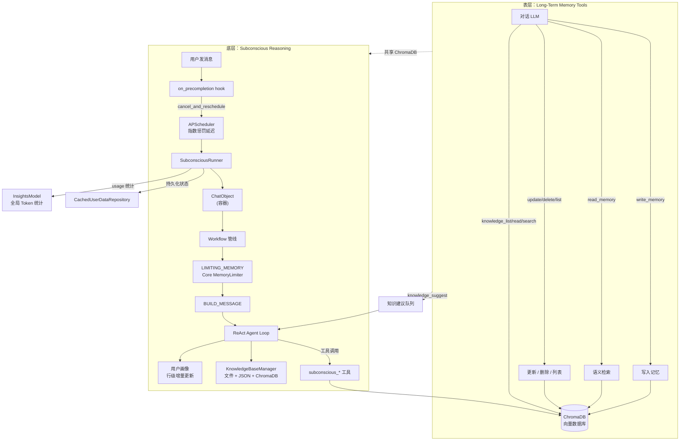
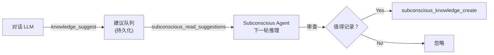
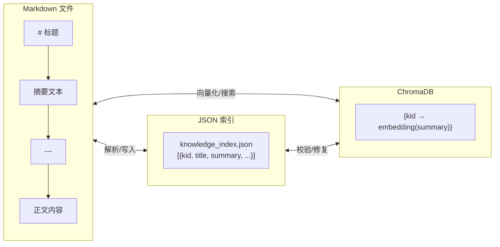
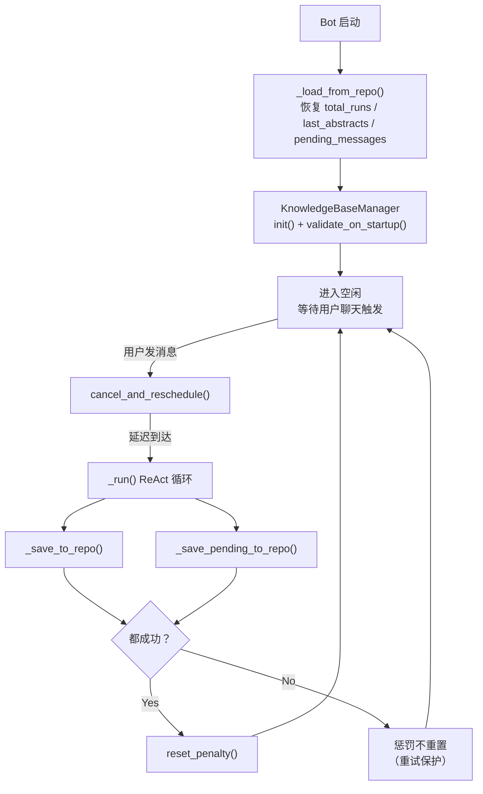
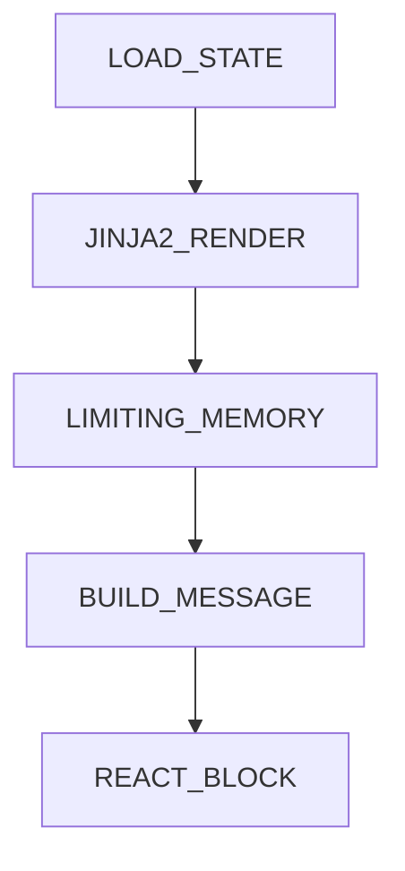

# amrita_plugin_memory

基于向量数据库与 Loop Engineering 的长期记忆与知识库插件 — 双层架构：表层 Function Calling 记忆工具 + 底层事件驱动潜意识推理。

- **表层** — LLM 对话中按需调用记忆工具（读写删改列），ChromaDB 语义检索。
- **底层** — 用户发消息时触发后台 Agent 整理记忆库，基于 Core Agent 框架复用 ChatObject 管线。

## 安装

```bash
ambot plugin add amrita_plugin_memory
```

前置依赖：Python 3.11+ / AmritaBot 实例 / Ollama 或 OpenAI 嵌入服务 / ChromaDB。

## 快速开始

### 1. 配置环境变量（`.env`）

```env
VECTOR_DB_TYPE=local
EMBEDDING_MODEL_URL=http://127.0.0.1:11434
EMBEDDING_MODEL_NAME=auto
EMBEDDING_PROCTOL=ollama-embed
```

### 2. 开启表层记忆

表层记忆开箱即用，无需额外配置。LLM 会在需要时自动调用 `write_memory` / `read_memory` 等工具。

### 3. 开启潜意识推理（可选）

编辑 `config/amrita_plugin_memory/config.toml`：

```toml
[subconscious]
enabled = true
target_user_id = "你的QQ号"
```

设置 `target_user_id` 为目标用户的 QQ 号，重启 Bot 即可。用户每次发消息后，后台 Agent 会在 30 分钟后自动整理记忆库。

> **适用场景**：潜意识推理专为**个人助理**场景设计——单个 Bot 服务单个用户。它会在后台持续调用 LLM 进行记忆整理，**每轮推理可能消耗数万 tokens**。如果 Bot 服务于大量用户或对 token 成本敏感，建议保持 `enabled = false`。

如需允许 Agent 主动给用户发私聊消息，额外开启：

```toml
allow_send_to_user = true
```

如需关闭全局知识库以节省 token：

```toml
enable_knowledge = false
```

> 知识库依赖潜意识推理——当 `enabled = false` 时，知识库也会自动禁用。

### 4. 验证

观察日志中 `[Subconscious]` 前缀的输出：

```text
[Subconscious] Starting for user=你的QQ号
[Subconscious] Idle — waiting for user chat to trigger first run
```

用户发消息后约 30 分钟，会看到 `Cycle #1` 开始执行。

---

## 双层架构



## 功能

### 表层：长期记忆

| 功能     | 说明                                           |
| -------- | ---------------------------------------------- |
| 语义检索 | ChromaDB 嵌入向量相似度搜索                    |
| 分区隔离 | `scope="user"` 个人 / `scope="group"` 群共享   |
| 重要性   | low / medium / high 三级，支持过滤             |
| 标签分类 | 自定义标签（preference、project、personal 等） |
| 过期清理 | 短期 7 天 / 长期 90 天                         |
| 并发安全 | 用户 ID 粒度 `aiologic.Lock`                   |

### 底层：潜意识推理

| 功能         | 说明                                                      |
| ------------ | --------------------------------------------------------- |
| 事件驱动     | 用户发消息触发，无活动则永远空闲                          |
| 惩罚退避     | 连续触发时指数延长延迟（30min→45min→...→1440min）         |
| 自动整理     | LLM 后台去重、合并、标签补全、低质清理                    |
| 记忆压缩     | Core `MemoryLimiter` 截断超限 + 自动摘要                  |
| 去重辅助     | `subconscious_duplicate_helper` 返回待整理记忆 + 合并指导 |
| 统计概览     | `subconscious_get_memory_stats` 总量/重要性/标签分布      |
| 膨胀感知     | ChromaDB 超 `memory_warn_threshold` 时注入压缩提示        |
| 滑动窗口     | `max_abstracts` 轮摘要保留，跨轮传递进度                  |
| 用户画像     | 行级增量更新，Markdown 文件持久化                         |
| Session 摘要 | MemoryLimiter 全量摘要 + LRU 缓存                         |
| 主动消息     | LLM 向用户发起主动问候（需 `allow_send_to_user`）         |
| Token 统计   | 复用 Bot `InsightsModel` 全局统计                         |

### 共享：全局知识库

知识库是**表层和潜意识双层共享**的资源。读取操作（`list`/`read`/`search`）通过双重 `@on_tools` 注册，对话 LLM 和后台 Agent 均可直接调用。**写入操作**（`create`/`update`/`delete`）仅限潜意识 Agent——表层通过 `knowledge_suggest` 提交建议，由 Agent 在下一轮推理中审查后决定是否实际写入：



每条知识由三个组件共同管理：



**文件格式**：第一行 `# 标题`，然后摘要文本，`---` 之后是正文。框架自动管理分割——LLM 只需传 `title`/`summary`/`body` 三个字段，无需手动处理 `---`。摘要被向量化存入 ChromaDB 用于语义搜索，正文存在文件中支持按行分段读取。

**启动自修复**（`validate_on_startup`）：启动时计算三方 ID 集合的差集，自动修复四种不一致：

| 场景     | 检测                         | 修复                        |
| -------- | ---------------------------- | --------------------------- |
| 孤文件   | 文件在，JSON 索引无          | 解析文件追加到索引 + 向量化 |
| 孤索引   | JSON 在，文件无              | 从索引中删除 + 清理向量     |
| 缺向量   | JSON+文件都在，ChromaDB 缺失 | 从摘要重新向量化写入        |
| 悬空向量 | 向量在，JSON 索引无          | 从 ChromaDB 删除            |

**行级读取**：`knowledge_read` 支持 `start_line`/`end_line` 参数——LLM 可以用滑动窗口分段读取长知识，避免一次加载超长内容。`knowledge_search` 只匹配摘要向量，找到相关条目后再用 `knowledge_read` 按需拉取正文。

## 工具参考

### 表层工具（`tools.py`）

| 工具                | 参数                                         |
| ------------------- | -------------------------------------------- |
| `write_memory`      | content, tags, importance(enum), scope(enum) |
| `read_memory`       | query, top_k(5), importance?, scope(enum)    |
| `update_memory`     | id, scope, content?, tags?, importance?      |
| `delete_memory`     | id, scope                                    |
| `list_memory`       | limit, scope                                 |
| `knowledge_list`    | —                                            |
| `knowledge_read`    | kid, start_line?, end_line?                  |
| `knowledge_search`  | query, top_k?                                |
| `knowledge_suggest` | action, title, summary, body, reason         |

### 潜意识工具（`rethinking/tools.py`）

记忆和 session/画像工具注册在隔离的 `_SUBCONSCIOUS_TOOLS` 上。知识库中 `list`/`read`/`search` 通过双重注册同时暴露给表层和潜意识；`create`/`update`/`delete` 仅潜意识可用（表层通过 `knowledge_suggest` 提交建议）：

| 工具                             | 用途                                   |
| -------------------------------- | -------------------------------------- |
| `subconscious_read_memory`       | 语义检索                               |
| `subconscious_write_memory`      | 写入新记忆                             |
| `subconscious_update_memory`     | 更新指定 ID 记忆                       |
| `subconscious_delete_memory`     | 删除指定 ID 记忆                       |
| `subconscious_list_memory`       | 列出全部记忆                           |
| `subconscious_iter_stop`         | 结束本轮推理                           |
| `subconscious_send_to_user`      | 主动向用户发消息                       |
| `subconscious_read_chat_context` | 读取最近聊天记录                       |
| `subconscious_duplicate_helper`  | 去重辅助（返回记忆 + 合并指导 prompt） |
| `subconscious_get_memory_stats`  | 统计概览                               |
| `subconscious_knowledge_list`    | 列出全局知识条目                       |
| `subconscious_knowledge_read`    | 读取知识条目（支持行滑动）             |
| `subconscious_knowledge_create`  | 创建知识条目                           |
| `subconscious_knowledge_update`  | 更新知识条目                           |
| `subconscious_knowledge_delete`  | 删除知识条目                           |
| `subconscious_read_suggestions`  | 读取待审查的知识建议（读取后清空）     |
| `subconscious_knowledge_search`  | 语义搜索知识库                         |
| `subconscious_read_sessions`     | 读取归档 sessions（LLM 摘要）          |
| `subconscious_get_profile`       | 读取用户画像（行滑动窗口）             |
| `subconscious_update_profile`    | 增量更新用户画像                       |

---

## 持久化与状态恢复

潜意识推理的状态跨重启持久化，确保 Bot 重启后不丢失进度。

### 持久化存储

| 存储             | 技术                                                  | 存什么                                                                                |
| ---------------- | ----------------------------------------------------- | ------------------------------------------------------------------------------------- |
| Runner 元状态    | `CachedUserDataRepository`（uid=`amrita_memory`）     | `total_runs`、`last_abstracts`（最近 N 轮摘要）、`pending_messages`（待发送消息队列） |
| 当前摘要         | 同上 `memory_json.abstract`                           | 最新一轮 MemoryLimiter 产出的摘要，注入 Jinja2 模板 `<SUMMARY>`                       |
| Session 摘要缓存 | `LRUCache[int, str]`（最大 128 条）                   | session DB id → LLM 生成的摘要文本，避免重复调用 MemoryLimiter                        |
| 惩罚计数器       | 内存（不持久化）                                      | `_penalty_count`：重启后从 0 开始，等价于"新鲜启动"                                   |
| 用户画像         | `data/user_profile.md`                                | Markdown 文件，`summary---body` 格式，行级增量更新                                    |
| 全局知识库       | `data/knowledge/` + `knowledge_index.json` + ChromaDB | 三方同步管理                                                                          |
| Token 统计       | `InsightsModel`（复用 Bot ORM）                       | 全局 prompt/completion token 累加                                                     |

### 生命周期



**跨重启连续性**：`last_abstracts` 通过 Jinja2 模板 `{{ last_abstracts }}` 和 `{{ last_run }}` 注入 prompt，让 Agent 知道"上一轮做了什么"——即使 Bot 重启，推理上下文也能部分延续。

**惩罚计数器不持久化**：重启后从 0 开始。设计意图：重启本身就是一次完整的"冷启动"，已有的记忆整理结果已经通过 ChromaDB 持久化了，不需要保留旧的退避状态。

---

## 调度策略

**事件驱动 + 指数惩罚退避**。不使用定时自循环——只有目标用户发消息时才触发推理。

用户每次聊天 → 取消现有计划 → 惩罚计数 +1 → 重新计算延迟：

$$\text{delay} = \min(\text{base} \times \text{multiplier}^{\text{penalty}-1},\ \text{cap})$$

默认参数：`base=30min`，`multiplier=1.5`，`cap=1440min`。推理成功后惩罚重置为 0。用户连续聊天会自动推开推理，长时间沉默后恢复正常频率。

## Workflow 管线

`SubconsciousRunner` 将 ChatObject 作为数据容器，注入自定义 `SubconsciousBackend` + Core `ReActAgentStrategy`：



`LIMITING_MEMORY` 在 Agent Loop 之前运行 Core `MemoryLimiter`：消息截断 → 摘要生成。`_build_config()` 将 `enable_memory_compress` 和 `loop_detect_threshold` 注入 `AmritaConfig`。

## 技术栈

| 组件       | 技术                                               |
| ---------- | -------------------------------------------------- |
| 后端框架   | Python 3.10+ / NoneBot2 / AmritaCore / AmritaSense |
| 向量数据库 | ChromaDB（PersistentClient / HttpClient）          |
| 嵌入模型   | OpenAI Embedding / Ollama Embedding                |
| 调度引擎   | nonebot_plugin_apscheduler（date trigger）         |
| 持久化     | CachedUserDataRepository                           |
| Token 统计 | InsightsModel（复用 Bot 全局 usage）               |
| 缓存       | nonebot_plugin_amrita.cache.LRUCache               |
| 配置管理   | Pydantic + TOML                                    |
| 代码质量   | Ruff + Pyright                                     |

## 配置详解

### `config/amrita_plugin_memory/config.toml`

```toml
# 记忆过期
short_term_expiry_days = 7
long_term_expiry_days = 90
per_session_memory_limit = 50

# 常驻推理循环
[subconscious]
enabled = false
target_user_id = ""
allowed_tools = []
max_iterations = 10
loop_detect_threshold = 3
rethink_base_delay_minutes = 30
rethink_penalty_multiplier = 1.5
rethink_max_delay_minutes = 1440
prompt_file = "prompt/subconscious_main.md.jinja2"
prompt_send_file = "prompt/subconscious_send.md.jinja2"
prompt_knowledge_file = "prompt/knowledge_guide.md.jinja2"
prompt_profile_file = "prompt/profile_guide.md.jinja2"
enable_memory_compress = true
allow_send_to_user = false
memory_warn_threshold = 100
max_abstracts = 5
knowledge_max_chars = 10000
knowledge_collection_name = "amrita_global_knowledge"
enable_knowledge = true
```

| 字段                         | 默认值                                 | 说明                                    |
| ---------------------------- | -------------------------------------- | --------------------------------------- |
| `enabled`                    | `false`                                | 是否启用潜意识循环                      |
| `target_user_id`             | `""`                                   | 目标用户 ID，为空则不启动               |
| `allowed_tools`              | `[]`                                   | 额外可用工具（从全局拉取）              |
| `max_iterations`             | `10`                                   | 单轮 ReAct 最大步数（预留）             |
| `loop_detect_threshold`      | `3`                                    | 传入 Core `loop_reasoning_trigger`      |
| `rethink_base_delay_minutes` | `30`                                   | 惩罚退避基数                            |
| `rethink_penalty_multiplier` | `1.5`                                  | 惩罚指数倍率                            |
| `rethink_max_delay_minutes`  | `1440`                                 | 惩罚延迟上限（1 天）                    |
| `prompt_file`                | `"prompt/subconscious_main.md.jinja2"` | 主推理提示词模板                        |
| `prompt_send_file`           | `"prompt/subconscious_send.md.jinja2"` | 主动消息生成模板                        |
| `prompt_knowledge_file`      | `"prompt/knowledge_guide.md.jinja2"`   | 知识库使用指南                          |
| `prompt_profile_file`        | `"prompt/profile_guide.md.jinja2"`     | 画像构建指南                            |
| `enable_memory_compress`     | `true`                                 | 传入 Core `enable_memory_abstract`      |
| `allow_send_to_user`         | `false`                                | 允许 Agent 主动发私聊消息               |
| `memory_warn_threshold`      | `100`                                  | ChromaDB 超此数量注入压缩提示           |
| `max_abstracts`              | `5`                                    | 摘要滑动窗口大小                        |
| `knowledge_max_chars`        | `10000`                                | 知识条目单条正文上限                    |
| `knowledge_collection_name`  | `"amrita_global_knowledge"`            | ChromaDB 知识库 collection              |
| `enable_knowledge`           | `true`                                 | 是否启用全局知识库（需 `enabled=true`） |

### 提示词模板

4 个 Jinja2 模板文件位于 `config/amrita_plugin_memory/prompt/`，首次缺失时自动从默认值创建：

| 文件                          | 用途         | 变量                                                                                             |
| ----------------------------- | ------------ | ------------------------------------------------------------------------------------------------ |
| `subconscious_main.md.jinja2` | 主推理提示词 | `character_prompt`, `last_run`, `last_abstracts`, `current_time`, `target_user_id`, `total_runs` |
| `subconscious_send.md.jinja2` | 主动消息生成 | `character_prompt`, `intent`, `memory_context`, `current_time`                                   |
| `knowledge_guide.md.jinja2`   | 知识库指南   | `current_time`, `target_user_id`                                                                 |
| `profile_guide.md.jinja2`     | 画像构建指南 | `current_time`, `target_user_id`                                                                 |

### 环境变量（`.env`）

| 变量                       | 类型                | 默认值                 | 说明          |
| -------------------------- | ------------------- | ---------------------- | ------------- |
| `VECTOR_DB_TYPE`           | local/remote        | local                  | ChromaDB 类型 |
| `VECTOR_DB_SERVER`         | string              | 127.0.0.1              | 远程地址      |
| `VECTOR_DB_PORT`           | int                 | 8000                   | 远程端口      |
| `VECTOR_DB_SERVER_SSL`     | bool                | false                  | 远程 SSL      |
| `VECTOR_DB_REMOTE_HEADERS` | dict                | {}                     | 远程请求头    |
| `VECTOR_DB_TENANT`         | string              | default                | 租户          |
| `VECTOR_DB_DATABASE`       | string              | default                | 数据库        |
| `EMBEDDING_MODEL_URL`      | string              | http://127.0.0.1:11434 | 嵌入模型地址  |
| `EMBEDDING_MODEL_NAME`     | string              | auto                   | 模型名        |
| `EMBEDDING_PROCTOL`        | openai/ollama-embed | ollama-embed           | 协议          |
| `EMBEDDING_MODEL_API_KEY`  | string              | (空)                   | API Key       |

## 项目结构

```
amrita_plugin_memory/
├── config.py                  # 配置模型（SubconsciousConfig / ConfigFile / EnvConfig）
├── tools.py                   # 表层记忆工具（write/read/update/delete/list）
├── vector.py                  # ChromaDB 封装（AsyncUserMemory / 锁池）
├── embed.py                   # 嵌入模型
├── matchers.py                # 匹配器
├── rethink/                   # 潜意识推理子系统
│   ├── _state.py              # 模块级状态（runner / penalty / pending / 隔离工具管理器）
│   ├── types.py               # TypedDict 定义（7 个数据结构）
│   ├── consts.py              # 默认 Prompt 模板 / ensure_prompt_file / load_character_prompt
│   ├── backend.py             # SubconsciousBackend — 隔离的工具 + memory 后端
│   ├── nodes.py               # LIMITING_MEMORY 工作流节点
│   ├── runner.py              # SubconsciousRunner — 核心编排器
│   ├── hooks.py               # on_precompletion hook / 生命周期管理
│   ├── tools.py               # 19 个潜意识工具 handler
│   ├── schemas.py             # 19 个 FunctionDefinitionSchema
│   └── knowledge.py           # KnowledgeBaseManager — 三方同步知识库
config/amrita_plugin_memory/
├── config.toml                # 插件配置文件
└── prompt/                    # Jinja2 提示词模板
    ├── subconscious_main.md.jinja2
    ├── subconscious_send.md.jinja2
    ├── knowledge_guide.md.jinja2
    ├── profile_guide.md.jinja2
    └── README.md
data/amrita_plugin_memory/
├── vector_db.chroma/          # ChromaDB 持久化
├── knowledge/                 # 知识文件（KNOWLEDGE_*.md）
├── knowledge_index.json       # 知识索引
└── user_profile.md            # 用户画像
```

## 开发

```bash
uv sync                       # 安装依赖
ruff check .                  # 代码检查
pyright                       # 类型检查
```
