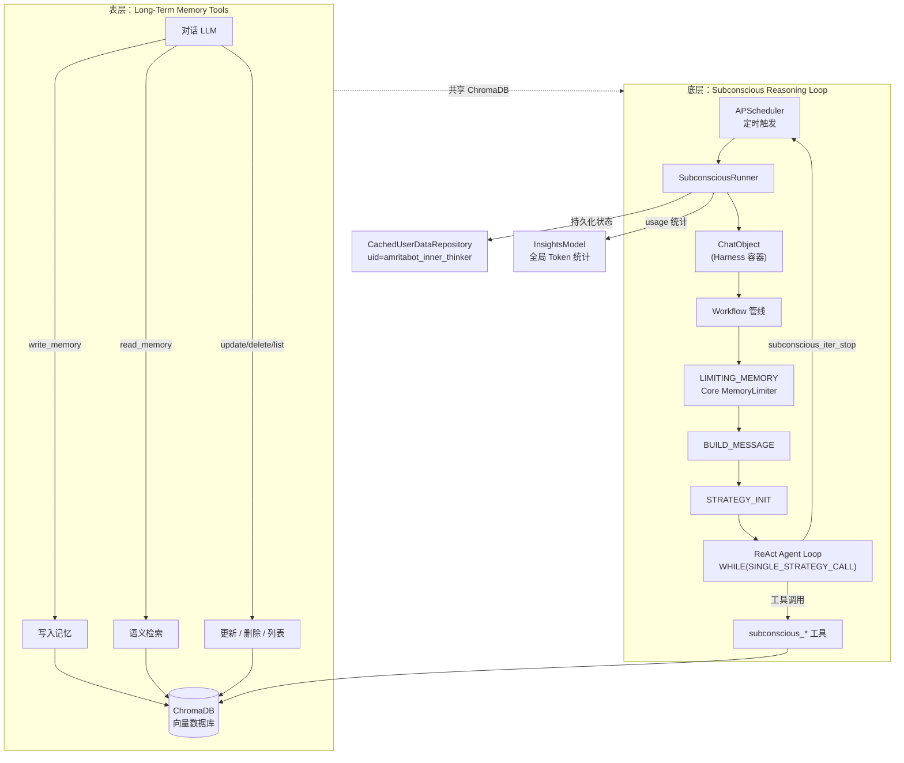

# amrita_plugin_memory

Amrita Harness 记忆增强插件 — 双层架构：表层 Function Calling 记忆工具 + 底层常驻推理循环 Agent。

**表层** — LLM 对话中按需调用 5 个记忆工具（读写删改列），基于 ChromaDB 语义检索。
**底层** — 后台 Agent 定时自动扫描、去重、合并、压缩记忆库，基于 Core Agent 框架 + Harness 模式复用 ChatObject。

## 双层架构



## Harness 模式

`SubconsciousRunner` 不自己管理推理循环，而是将 **ChatObject 作为数据容器**，注入自定义 `SubconsciousBackend` + Core `ReActAgentStrategy`，通过替换 `_workflow` / `_interpreter` 复用完整的 Core Agent 管线：

```
LOAD_STATE → JINJA2_RENDER → LIMITING_MEMORY → BUILD_MESSAGE → STRATEGY_INIT
  → AGENT_ENTRY → WHILE(SINGLE_STRATEGY_CALL).ACTION(REACT_COUNTER)
```

`LIMITING_MEMORY` **在 Agent Loop 之前**运行 Core `MemoryLimiter`：消息截断 → token 限制 → 自动生成摘要。摘要通过 Core Jinja2 模板 `<SUMMARY>` 标签注入 prompt。

暂停时 `dump_interpreter()`，恢复时 `rebase_context()`，毫秒级断点续推理。

## 技术栈

| 组件       | 技术                                                      |
| ---------- | --------------------------------------------------------- |
| 后端框架   | Python 3.11+ / NoneBot2 / AmritaCore / AmritaSense        |
| 向量数据库 | ChromaDB（PersistentClient / HttpClient）                 |
| 嵌入模型   | OpenAI Embedding / Ollama Embedding                       |
| 调度引擎   | nonebot_plugin_apscheduler                                |
| 持久化     | CachedUserDataRepository（uid=`amritabot_inner_thinker`） |
| Token 统计 | InsightsModel（复用 Bot 全局 usage 统计）                 |
| 配置管理   | Pydantic + TOML                                           |
| 代码质量   | Ruff + Pyright                                            |

## 功能

### 表层：长期记忆

| 功能     | 说明                                             |
| -------- | ------------------------------------------------ |
| 语义检索 | ChromaDB 嵌入向量相似度搜索，中日英多语言        |
| 分区隔离 | `scope="user"` 个人记忆 / `scope="group"` 群共享 |
| 重要性   | low / medium / high 三级，支持过滤               |
| 标签分类 | 自定义标签（preference、project、personal 等）   |
| 过期清理 | 短/长/永久三级过期天数可配置                     |
| 并发安全 | 用户 ID 粒度 `aiologic.Lock`                     |

### 底层：常驻推理循环

| 功能       | 说明                                                             |
| ---------- | ---------------------------------------------------------------- |
| 自动整理   | LLM 后台去重、合并、标签补全、低质清理                           |
| 自调度     | `subconscious_iter_stop` 返回下次运行时间                        |
| 记忆压缩   | Core `MemoryLimiter` 截断超限消息 + 自动生成摘要                 |
| 去重辅助   | `subconscious_duplicate_helper` 返回待整理记忆 + 合并指导 prompt |
| 统计概览   | `subconscious_get_memory_stats` 总量/重要性分布/标签分布         |
| 膨胀感知   | ChromaDB 超 `memory_warn_threshold` 时自动注入压缩提示           |
| 滑动窗口   | `max_abstracts` 轮摘要保留，跨轮传递进度                         |
| 暂停协调   | 目标用户聊天时自动暂停+随机延迟恢复                              |
| 主动消息   | LLM 向用户发起主动问候（需 `allow_send_to_user`）                |
| Token 统计 | 复用 Bot `InsightsModel` 全局统计，无需额外维护                  |

## 工具

### 表层工具（`tools.py`）

LLM 在对话中按需调用，受 `scope` 分区隔离：

| 工具            | 参数                                         |
| --------------- | -------------------------------------------- |
| `write_memory`  | content, tags, importance(enum), scope(enum) |
| `read_memory`   | query, top_k(5), importance?, scope(enum)    |
| `update_memory` | id, scope, content?, tags?, importance?      |
| `delete_memory` | id, scope                                    |
| `list_memory`   | limit, scope                                 |

### 潜意识工具（`rethinking/tools.py`）

仅供 Subconscious Agent 使用，不暴露给对话 LLM：

| 工具                             | 用途                                        |
| -------------------------------- | ------------------------------------------- |
| `subconscious_read_memory`       | 语义检索（硬编码 user scope）               |
| `subconscious_write_memory`      | 写入新记忆                                  |
| `subconscious_update_memory`     | 更新指定 ID 记忆                            |
| `subconscious_delete_memory`     | 删除指定 ID 记忆                            |
| `subconscious_list_memory`       | 列出全部记忆                                |
| `subconscious_iter_stop`         | 结束本轮，设置下次运行时间                  |
| `subconscious_send_to_user`      | 主动向用户发消息（需 allow_send_to_user）   |
| `subconscious_read_chat_context` | 读取用户最近聊天记录                        |
| `subconscious_duplicate_helper`  | 返回全部记忆 + LLM 合并指导 prompt（去重）  |
| `subconscious_get_memory_stats`  | 统计概览：总数/重要性分布/标签分布/时间范围 |

## 配置

### `config/amrita_plugin_memory/config.toml`

```toml
# 记忆过期
short_term_expiry_days = 3
long_term_expiry_days = 30
permanent_expiry_days = 365
per_session_memory_limit = 50

# 常驻推理循环
[subconscious]
enabled = false               # 是否启用
experimental = true           # 实验性标注
target_user_id = ""           # 目标用户 ID（必填）
allowed_tools = []            # 额外可用工具
max_iterations = 10           # 单轮 ReAct 最大步数
loop_detect_threshold = 3     # 连续同工具触发警告阈值
initial_delay_seconds = 60    # 启动后首轮延迟
default_interval_seconds = 600# LLM 未指定时默认间隔
pause_on_user_chat = true     # 用户聊天时自动暂停
pause_wakeup_min_seconds = 180# 暂停后最小唤醒延迟
pause_wakeup_max_seconds = 480# 暂停后最大唤醒延迟
prompt_file = "subconscious_prompt.txt"
enable_memory_compress = true # 启用 MemoryLimiter 上下文压缩
allow_send_to_user = false    # 允许 Agent 主动发消息
memory_warn_threshold = 100   # ChromaDB 超此数量注入压缩提示
max_abstracts = 5             # 摘要滑动窗口大小
```

### 提示词模板

两个 Jinja2 模板文件位于 `config/amrita_plugin_memory/`：

**`subconscious_prompt.txt`** — Agent 系统提示词（由 `prompt_file` 配置指定）

| 模板变量           | 说明                               |
| ------------------ | ---------------------------------- |
| `{{ last_run }}`   | 上一轮 MemoryLimiter 产出的摘要     |
| `{{ last_abstracts }}` | 最近 N 轮摘要列表（max_abstracts 控制） |
| `{{ current_time }}`   | 当前 UTC 时间                    |
| `{{ target_user_id }}` | 目标用户 ID                      |
| `{{ total_runs }}`     | 累计运行轮数                     |

**`subconscious_send_prompt.txt`** — 主动消息生成模板

| 模板变量               | 说明                 |
| ---------------------- | -------------------- |
| `{{ intent }}`         | LLM 指定的消息意图    |
| `{{ memory_context }}` | 关联的记忆上下文      |
| `{{ current_time }}`   | 当前 UTC 时间         |

### 环境变量（`.env`）

| 变量                      | 类型                | 默认值                 | 说明          |
| ------------------------- | ------------------- | ---------------------- | ------------- |
| `VECTOR_DB_TYPE`          | local/remote        | local                  | ChromaDB 类型 |
| `VECTOR_DB_SERVER`        | string              | 127.0.0.1              | 远程地址      |
| `VECTOR_DB_PORT`          | int                 | 8000                   | 远程端口      |
| `EMBEDDING_MODEL_URL`     | string              | http://127.0.0.1:11434 | 嵌入模型地址  |
| `EMBEDDING_MODEL_NAME`    | string              | auto                   | 模型名        |
| `EMBEDDING_PROCTOL`       | openai/ollama-embed | ollama-embed           | 协议          |
| `EMBEDDING_MODEL_API_KEY` | string              | (空)                   | API Key       |

## 安装

```bash
ambot plugin install amrita_plugin_memory
```

前置：Python 3.11+ / AmritaBot 实例 / Ollama 或 OpenAI 嵌入服务 / ChromaDB。

## 开发

```bash
uv sync                       # 安装依赖
ruff format . && ruff check . # 格式化 + 检查
pyright                       # 类型检查
```
